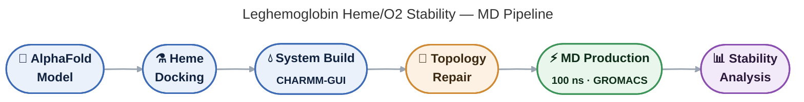

# Molecular Dynamics Analysis of Heme- and Oxygen-Binding Stability in Engineered Leghemoglobin Variants

Molecular dynamics (MD) simulation pipeline investigating the effect of site-directed mutations on heme cofactor binding stability and O2 coordination in leghemoglobin homologs from two plant species: *Pisum sativum* (garden pea) and *Ononis spinosa*.

## Pipeline Overview


## Overview

This repository contains the complete computational pipeline — structure preparation, topology generation, custom force-field patching, production MD, and trajectory analysis — used to compare heme-binding stability across wild-type and mutant leghemoglobin variants, both in the ligand-free (deoxy) state and with molecular oxygen bound at the heme iron (oxy state).

**Systems studied:**

| Species | Variant | Mutation(s) | Proximal His |
|---|---|---|---|
| *P. sativum* | WT (LegHEM22) | — | His93 |
| *P. sativum* | V53T | Val53→Thr | His93 |
| *P. sativum* | V83T | Val83→Thr | His93 |
| *P. sativum* | V53T/V83T | Val53→Thr + Val83→Thr | His93 |
| *O. spinosa* | WT (Natural) | — | His110 |
| *O. spinosa* | L43W | Leu43→Trp | His110 |
| *O. spinosa* | F125W | Phe125→Trp | His110 |
| *O. spinosa* | F125W/L43W | Phe125→Trp + Leu43→Trp | His110 |

Each variant was simulated **with and without** an O2 ligand bound to the heme iron (16 systems total), for 100 ns of production MD at 298.15 K.

## Repository Structure

```
.
├── docs/
│   ├── METHODOLOGY.md              # Full step-by-step protocol (structure prep → analysis)
│   ├── KNOWN_ISSUES_AND_FIXES.md   # Documented software bugs and their resolutions
│   └── RESULTS_SUMMARY.md          # Key numerical results and interpretation
├── scripts/
│   ├── topology_fixes/             # ParmEd-based topology repair scripts
│   ├── simulation/                 # SLURM job scripts (GROMACS on GPU cluster)
│   └── analysis/                   # MDAnalysis-based trajectory analysis
├── parameters/                     # Representative GROMACS .mdp parameter files
├── results/                        # Summary tables (CSV) of stability metrics
└── README.md
```

Raw trajectory files (`.xtc`, `.trr`), full CHARMM36 parameter sets (`toppar/`), and intermediate checkpoint files are **not** version-controlled here due to size; see [Data Availability](#data-availability) below.

## Pipeline Summary

1. **Structure prediction** — AlphaFold2 models (no experimental structure available for either species).
2. **Heme docking** — homology-based cofactor transplantation from PDB template 1FSL (PyMOL).
3. **System preparation** — CHARMM-GUI Solution Builder (solvation, ion placement, CHARMM36m topology, PHEM patch for Fe–His coordination).
4. **Topology conversion & manual repair** — ParmEd (PSF/CHARMM → GROMACS), including manual reconstruction of a peptide bond mis-assigned by CHARMM-GUI's chain-detection heuristic (see `docs/KNOWN_ISSUES_AND_FIXES.md`), and de novo O2 ligand placement/parametrization at the heme iron.
5. **Minimization → NVT equilibration → NPT production (100 ns)** — GROMACS 2023.4, CHARMM36m force field, TIP3P water, 0.15 M KCl.
6. **Analysis** — MDAnalysis: heme/O2–protein RMSD (backbone-aligned), Fe–His and Fe–O2 bond distance stability over the trajectory.

Full protocol with exact commands: [`docs/METHODOLOGY.md`](docs/METHODOLOGY.md).

## Key Findings (preliminary — see caveats)

- Both species show a mirrored, opposite-direction epistatic pattern: in *P. sativum*, single mutations improve heme-pocket stability while the double mutant is worse than either (negative epistasis); in *O. spinosa*, single mutations reduce stability while the double mutant is the most stable variant (positive epistasis).
- All systems maintained a stable Fe–O2 bond (~1.80 Å) throughout 100 ns production, indicating no gross functional impairment in any genotype tested.
- WT systems in both species became more stable upon O2 binding, while the tested mutants (V83T, F125W) became less stable — suggesting mutation effects favorable in the deoxy state do not necessarily transfer to the O2-bound, functional state.

**Caveats:** results are based on a single 100 ns replicate per system; AlphaFold-derived (non-experimental) starting structures were used; an initial *O. spinosa* topology defect (see `docs/KNOWN_ISSUES_AND_FIXES.md`) was identified and corrected, which substantially changed the *O. spinosa* deoxy-state ranking — see `docs/RESULTS_SUMMARY.md` for the full revision note. See `docs/RESULTS_SUMMARY.md` for complete discussion and literature comparison.

## Data Availability

Large binary files (trajectories, full parameter sets, checkpoint files; several GB total) are archived separately on **[Zenodo — DOI to be added]** and are not stored in this Git repository. Scripts in this repository reference relative paths that assume the Zenodo archive is extracted alongside `scripts/`.

## Software & Dependencies

- GROMACS 2023.4
- CHARMM-GUI (Solution Builder) with CHARMM36m force field
- ParmEd (Python topology conversion)
- MDAnalysis (trajectory analysis)
- PyMOL (structure docking)
- Python ≥3.9, NumPy

## Citation


## Contact

[Mohammad Hossein Pakdel / mhpakdel96@gmail.com]
