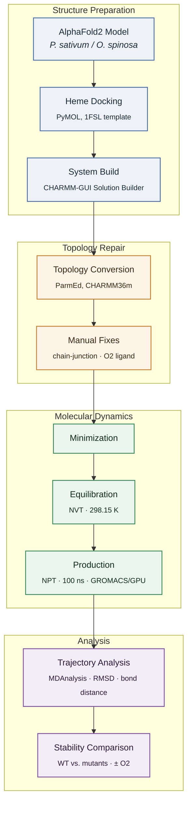

## Pipeline Overview

```mermaid
flowchart TD
    subgraph PREP["Structure Preparation"]
        A["AlphaFold2 Model<br/><i>P. sativum / O. spinosa</i>"] --> B["Heme Docking<br/><sub>PyMOL, 1FSL template</sub>"]
        B --> C["System Build<br/><sub>CHARMM-GUI Solution Builder</sub>"]
    end

    subgraph TOPO["Topology Repair"]
        C --> D["Topology Conversion<br/><sub>ParmEd, CHARMM36m</sub>"]
        D --> E["Manual Fixes<br/><sub>chain-junction · O2 ligand</sub>"]
    end

    subgraph MD["Molecular Dynamics"]
        E --> F["Minimization"]
        F --> G["Equilibration<br/><sub>NVT · 298.15 K</sub>"]
        G --> H["Production<br/><sub>NPT · 100 ns · GROMACS/GPU</sub>"]
    end

    subgraph OUT["Analysis"]
        H --> I["Trajectory Analysis<br/><sub>MDAnalysis · RMSD · bond distance</sub>"]
        I --> J["Stability Comparison<br/><sub>WT vs. mutants · ± O2</sub>"]
    end

    classDef prep fill:#eef2f7,stroke:#4a6fa5,stroke-width:1.5px,color:#1a2b3c;
    classDef topo fill:#fdf3e7,stroke:#c8802d,stroke-width:1.5px,color:#3c2a12;
    classDef md fill:#eaf5ee,stroke:#3a8a5a,stroke-width:1.5px,color:#0f2e1a;
    classDef out fill:#f3edf7,stroke:#7d4d9e,stroke-width:1.5px,color:#2b1a3c;

    class A,B,C prep
    class D,E topo
    class F,G,H md
    class I,J out
```
